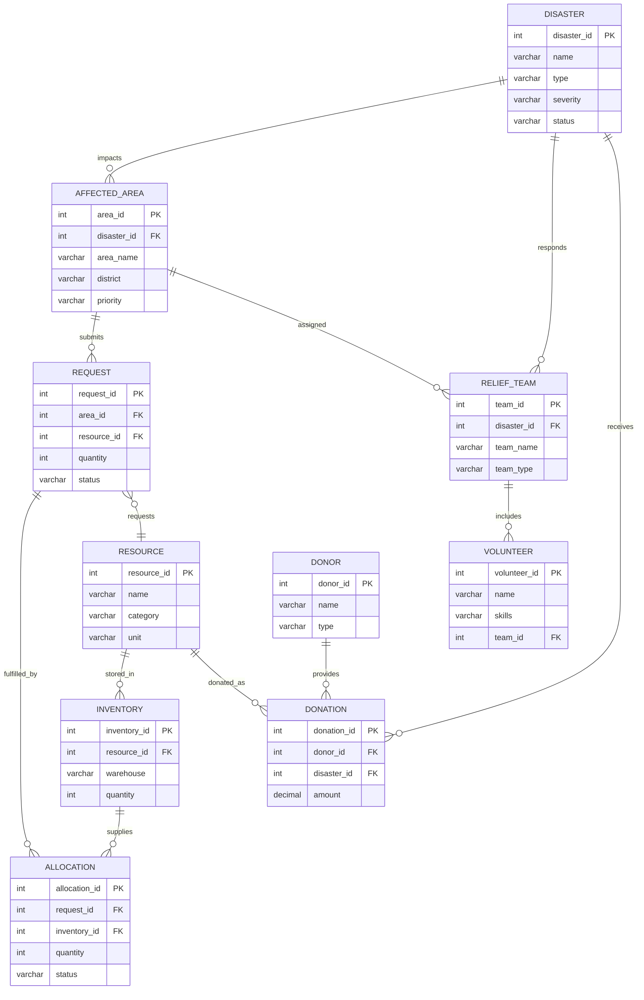

# 📊 Disaster Relief Resource Management System
## Entity-Relationship Diagram Design (Simplified)

---

## 1. System Overview

The **Disaster Relief Resource Management System (DRRMS)** is a database solution for coordinating disaster relief operations. This simplified design uses **10 core entities** while still demonstrating all essential DBMS concepts.

---

## 2. Entity List (10 Tables)

| # | Entity | Description |
|---|--------|-------------|
| 1 | Disaster | Disaster events (cyclone, flood, earthquake) |
| 2 | Affected_Area | Regions impacted by disasters |
| 3 | Resource | Relief items (food, water, medicine) |
| 4 | Inventory | Stock levels of resources |
| 5 | Request | Resource requests from affected areas |
| 6 | Allocation | Resource assignments to requests |
| 7 | Volunteer | Individual volunteers |
| 8 | Relief_Team | Response teams |
| 9 | Donor | Individuals/organizations providing donations |
| 10 | Donation | Recorded donations |

---

## 3. Entity Specifications

### 3.1 🌀 DISASTER

| Attribute | Data Type | Constraints | Description |
|-----------|-----------|-------------|-------------|
| disaster_id | INT | PRIMARY KEY, AUTO_INCREMENT | Unique ID |
| disaster_name | VARCHAR(100) | NOT NULL | Name of disaster |
| disaster_type | VARCHAR(50) | NOT NULL | Cyclone, Earthquake, Flood, Fire |
| severity | VARCHAR(20) | NOT NULL | Low, Medium, High, Critical |
| start_date | DATE | NOT NULL | When it started |
| end_date | DATE | NULL | When it ended |
| description | TEXT | NULL | Details |
| status | VARCHAR(20) | DEFAULT 'Active' | Active, Resolved |

---

### 3.2 📍 AFFECTED_AREA

| Attribute | Data Type | Constraints | Description |
|-----------|-----------|-------------|-------------|
| area_id | INT | PRIMARY KEY, AUTO_INCREMENT | Unique ID |
| disaster_id | INT | FOREIGN KEY → Disaster | Linked disaster |
| area_name | VARCHAR(100) | NOT NULL | Area name |
| district | VARCHAR(100) | NOT NULL | District |
| state | VARCHAR(100) | NOT NULL | State |
| population_affected | INT | NULL | People affected |
| priority | VARCHAR(20) | DEFAULT 'Medium' | Low, Medium, High, Critical |

---

### 3.3 📦 RESOURCE

| Attribute | Data Type | Constraints | Description |
|-----------|-----------|-------------|-------------|
| resource_id | INT | PRIMARY KEY, AUTO_INCREMENT | Unique ID |
| resource_name | VARCHAR(100) | NOT NULL | Name of resource |
| category | VARCHAR(50) | NOT NULL | Food, Water, Medicine, Shelter, Equipment |
| unit | VARCHAR(20) | NOT NULL | Kg, Liters, Units, Boxes |
| min_stock | INT | DEFAULT 0 | Minimum threshold |

---

### 3.4 📊 INVENTORY

| Attribute | Data Type | Constraints | Description |
|-----------|-----------|-------------|-------------|
| inventory_id | INT | PRIMARY KEY, AUTO_INCREMENT | Unique ID |
| resource_id | INT | FOREIGN KEY → Resource | Resource type |
| warehouse_location | VARCHAR(100) | NOT NULL | Storage location |
| quantity_available | INT | NOT NULL, DEFAULT 0 | Current stock |
| last_updated | TIMESTAMP | DEFAULT CURRENT_TIMESTAMP | Last update |

---

### 3.5 📝 REQUEST

| Attribute | Data Type | Constraints | Description |
|-----------|-----------|-------------|-------------|
| request_id | INT | PRIMARY KEY, AUTO_INCREMENT | Unique ID |
| area_id | INT | FOREIGN KEY → Affected_Area | Requesting area |
| resource_id | INT | FOREIGN KEY → Resource | Requested resource |
| quantity_requested | INT | NOT NULL | Amount needed |
| urgency | VARCHAR(20) | NOT NULL | Low, Medium, High, Critical |
| request_date | TIMESTAMP | DEFAULT CURRENT_TIMESTAMP | When requested |
| status | VARCHAR(20) | DEFAULT 'Pending' | Pending, Approved, Fulfilled, Rejected |

---

### 3.6 ✅ ALLOCATION

| Attribute | Data Type | Constraints | Description |
|-----------|-----------|-------------|-------------|
| allocation_id | INT | PRIMARY KEY, AUTO_INCREMENT | Unique ID |
| request_id | INT | FOREIGN KEY → Request | Linked request |
| inventory_id | INT | FOREIGN KEY → Inventory | Source inventory |
| quantity_allocated | INT | NOT NULL | Amount assigned |
| allocation_date | TIMESTAMP | DEFAULT CURRENT_TIMESTAMP | When allocated |
| delivery_status | VARCHAR(20) | DEFAULT 'Pending' | Pending, Dispatched, Delivered |
| delivered_date | TIMESTAMP | NULL | Delivery timestamp |

---

### 3.7 👤 VOLUNTEER

| Attribute | Data Type | Constraints | Description |
|-----------|-----------|-------------|-------------|
| volunteer_id | INT | PRIMARY KEY, AUTO_INCREMENT | Unique ID |
| name | VARCHAR(100) | NOT NULL | Full name |
| email | VARCHAR(100) | UNIQUE | Email address |
| phone | VARCHAR(15) | NOT NULL | Phone number |
| skills | VARCHAR(200) | NULL | Comma-separated skills |
| availability | VARCHAR(20) | DEFAULT 'Available' | Available, Busy, Unavailable |
| team_id | INT | FOREIGN KEY → Relief_Team | Assigned team |

---

### 3.8 👥 RELIEF_TEAM

| Attribute | Data Type | Constraints | Description |
|-----------|-----------|-------------|-------------|
| team_id | INT | PRIMARY KEY, AUTO_INCREMENT | Unique ID |
| disaster_id | INT | FOREIGN KEY → Disaster | Assigned disaster |
| team_name | VARCHAR(100) | NOT NULL | Team name |
| team_type | VARCHAR(50) | NOT NULL | Rescue, Medical, Logistics, Distribution |
| area_id | INT | FOREIGN KEY → Affected_Area | Assigned area |
| leader_name | VARCHAR(100) | NULL | Team leader |
| status | VARCHAR(20) | DEFAULT 'Active' | Active, Standby, Disbanded |

---

### 3.9 💰 DONOR

| Attribute | Data Type | Constraints | Description |
|-----------|-----------|-------------|-------------|
| donor_id | INT | PRIMARY KEY, AUTO_INCREMENT | Unique ID |
| donor_name | VARCHAR(150) | NOT NULL | Name |
| donor_type | VARCHAR(50) | NOT NULL | Individual, Corporate, NGO, Government |
| email | VARCHAR(100) | NULL | Email |
| phone | VARCHAR(15) | NULL | Phone |
| address | TEXT | NULL | Address |

---

### 3.10 🎁 DONATION

| Attribute | Data Type | Constraints | Description |
|-----------|-----------|-------------|-------------|
| donation_id | INT | PRIMARY KEY, AUTO_INCREMENT | Unique ID |
| donor_id | INT | FOREIGN KEY → Donor | Who donated |
| disaster_id | INT | FOREIGN KEY → Disaster | Target disaster |
| donation_type | VARCHAR(20) | NOT NULL | Money, Material |
| amount | DECIMAL(12,2) | NULL | Monetary amount |
| resource_id | INT | FOREIGN KEY → Resource | For material donations |
| quantity | INT | NULL | Material quantity |
| donation_date | TIMESTAMP | DEFAULT CURRENT_TIMESTAMP | When donated |
| receipt_no | VARCHAR(50) | UNIQUE | Receipt number |

---

## 4. Entity Relationship Diagram

```
┌─────────────────────────────────────────────────────────────────────┐
│              DISASTER RELIEF RESOURCE MANAGEMENT SYSTEM              │
│                    Simplified ER Diagram (10 Entities)               │
└─────────────────────────────────────────────────────────────────────┘

                            ┌──────────────┐
                            │   DISASTER   │
                            │──────────────│
                            │ disaster_id  │ PK
                            │ name, type   │
                            │ severity     │
                            │ status       │
                            └──────┬───────┘
                                   │
              ┌────────────────────┼────────────────────┐
              │ 1:N                │ 1:N                │ 1:N
              ▼                    ▼                    ▼
      ┌──────────────┐    ┌──────────────┐    ┌──────────────┐
      │AFFECTED_AREA │    │ RELIEF_TEAM  │    │   DONATION   │
      │──────────────│    │──────────────│    │──────────────│
      │ area_id  PK  │    │ team_id  PK  │    │donation_id PK│
      │ disaster_id  │    │ disaster_id  │    │ disaster_id  │
      │ area_name    │    │ team_name    │    │ donor_id     │
      │ priority     │    │ team_type    │    │ amount       │
      └──────┬───────┘    └──────┬───────┘    └──────┬───────┘
             │                   │                   │
             │ 1:N               │ 1:N               │ N:1
             ▼                   ▼                   ▼
      ┌──────────────┐    ┌──────────────┐    ┌──────────────┐
      │   REQUEST    │    │  VOLUNTEER   │    │    DONOR     │
      │──────────────│    │──────────────│    │──────────────│
      │ request_id PK│    │volunteer_id  │    │ donor_id  PK │
      │ area_id      │    │ name, email  │    │ donor_name   │
      │ resource_id  │    │ team_id      │    │ donor_type   │
      │ quantity     │    │ skills       │    │ contact      │
      │ status       │    │ availability │    └──────────────┘
      └──────┬───────┘    └──────────────┘
             │
             │ 1:N
             ▼
      ┌──────────────┐
      │  ALLOCATION  │
      │──────────────│
      │allocation_id │
      │ request_id   │
      │ inventory_id │◄──────┐
      │ quantity     │       │
      │ status       │       │
      └──────────────┘       │
                             │
      ┌──────────────┐    ┌──┴───────────┐
      │   RESOURCE   │◄───│  INVENTORY   │
      │──────────────│ N:1│──────────────│
      │resource_id PK│    │inventory_id  │
      │ name         │    │ resource_id  │
      │ category     │    │ warehouse    │
      │ unit         │    │ quantity     │
      └──────────────┘    └──────────────┘
```

---

## 5. Relationship Summary

| Relationship | Type | Description |
|--------------|------|-------------|
| Disaster → Affected_Area | 1:N | One disaster impacts many areas |
| Disaster → Relief_Team | 1:N | One disaster has many response teams |
| Disaster → Donation | 1:N | One disaster receives many donations |
| Affected_Area → Request | 1:N | One area makes many requests |
| Affected_Area → Relief_Team | 1:N | Teams assigned to areas |
| Request → Allocation | 1:N | One request can have multiple allocations |
| Resource → Inventory | 1:N | One resource in multiple locations |
| Resource → Request | 1:N | One resource in multiple requests |
| Inventory → Allocation | 1:N | One inventory supplies many allocations |
| Relief_Team → Volunteer | 1:N | One team has many volunteers |
| Donor → Donation | 1:N | One donor makes many donations |
| Resource → Donation | 1:N | Materials donated as resources |

---

## 6. Visual ER Diagram (Mermaid)



---

## 7. DBMS Concepts Covered

| Concept | How It's Demonstrated |
|---------|----------------------|
| **Primary Keys** | All 10 tables have AUTO_INCREMENT PKs |
| **Foreign Keys** | 12 foreign key relationships |
| **Normalization (3NF)** | No redundant data |
| **Joins** | Multi-table queries across entities |
| **Views** | Dashboard views, pending requests |
| **Triggers** | Auto-update inventory on allocation |
| **Stored Procedures** | Allocation logic, reports |
| **Transactions** | Atomic allocation + inventory update |
| **Constraints** | UNIQUE, NOT NULL, DEFAULT |

---

## 8. Sample Scenario Flow

```
1. DISASTER occurs (Cyclone Amphan)
        ↓
2. AFFECTED_AREAs registered (3 coastal districts)
        ↓
3. REQUESTs submitted (Water: 1000L, Medicine: 500 units)
        ↓
4. INVENTORY checked → ALLOCATION created
        ↓
5. RELIEF_TEAM assigned → VOLUNTEERs deployed
        ↓
6. DONORs contribute → DONATIONs recorded
        ↓
7. Resources delivered, ALLOCATION status updated
```

---

## 9. Next Steps

1. [ ] Create SQL Schema (DDL)
2. [ ] Add Sample Data
3. [ ] Write Queries & Joins
4. [ ] Create Views
5. [ ] Implement Triggers
6. [ ] Write Stored Procedures
7. [ ] Build Simple Web Interface (Optional)

---

*Simplified Design: 10 Entities | 12 Relationships | Full DBMS Coverage*
