# 📊 DRRMS - Visual Entity Relationship Diagram

## Complete ER Diagram (Simplified - 10 Entities)

---

## Module-wise Diagrams

### Module A: Disaster & Area Management

### Module B: Resource & Inventory

### Module C: Request & Allocation

### Module D: Team & Volunteer

### Module E: Donation Tracking

---

## Data Flow Diagram

```mermaid
flowchart TD
    subgraph Event["🌀 Disaster Event"]
        D[Disaster Registered]
    end
    
    subgraph Areas["📍 Impact Assessment"]
        D --> AA[Affected Areas Mapped]
    end
    
    subgraph Resources["📦 Resources"]
        RES[(Resource Catalog)]
        INV[(Inventory Stock)]
        RES --> INV
    end
    
    subgraph Requests["📝 Request Flow"]
        AA --> REQ[Requests Submitted]
        REQ --> ALO[Allocations Made]
        INV --> ALO
    end
    
    subgraph Teams["👥 Response"]
        D --> RT[Relief Teams Formed]
        RT --> VOL[Volunteers Assigned]
        VOL --> ALO
    end
    
    subgraph Funding["💰 Donations"]
        DON[Donors]
        DON --> DONA[Donations]
        DONA --> D
        DONA --> INV
    end
    
    ALO --> DEL[Delivery Complete ✅]
```

---

## System Overview

```mermaid
flowchart LR
    subgraph Users["👥 Users"]
        ADMIN[Admin]
        COORD[Coordinator]
        FIELD[Field Officer]
    end
    
    subgraph App["🖥️ Application"]
        WEB[Web Interface]
    end
    
    subgraph DB["🗄️ Database"]
        MYSQL[(MySQL)]
    end
    
    Users --> App --> DB
```

---

*Simplified: 10 Entities | Easy to Implement | Full DBMS Coverage*
