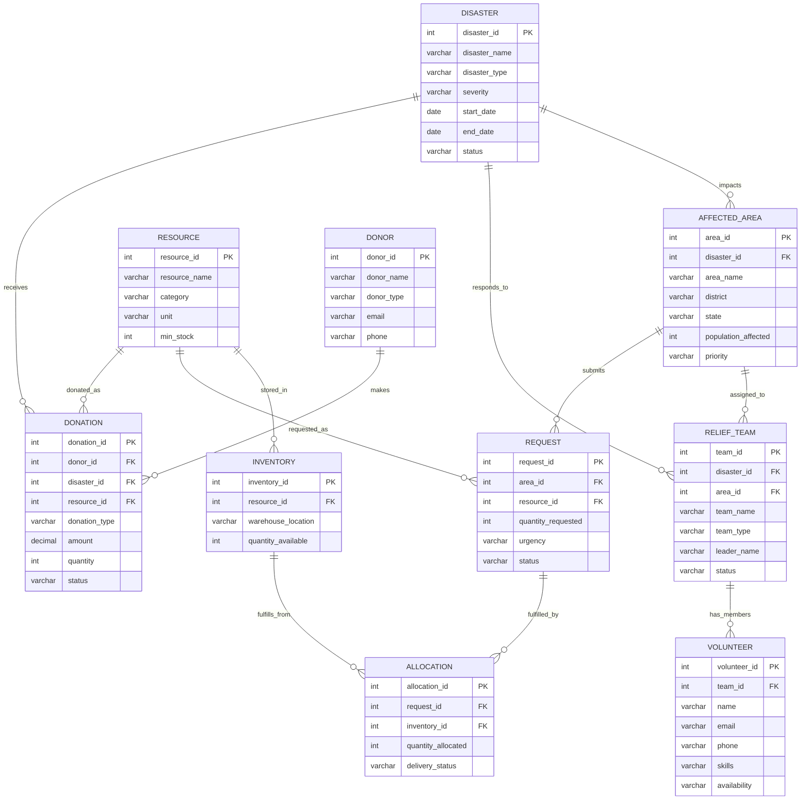

# DRRMS Entity-Relationship Diagram

## Overview
The Disaster Relief Resource Management System (DRRMS) consists of **10 core entities** managing disaster events, affected areas, resources, volunteers, and donations.

---

## ER Diagram

---

## Entity Relationships Summary

| Relationship | Cardinality | Description |
|--------------|-------------|-------------|
| Disaster → Affected_Area | 1:N | A disaster impacts multiple areas |
| Disaster → Relief_Team | 1:N | Teams are formed to respond to disasters |
| Disaster → Donation | 1:N | Donations can be made for specific disasters |
| Affected_Area → Request | 1:N | Areas submit multiple resource requests |
| Affected_Area → Relief_Team | 1:N | Teams are assigned to specific areas |
| Resource → Inventory | 1:N | Resources are stored in multiple warehouses |
| Resource → Request | 1:N | Resources can be requested multiple times |
| Resource → Donation | 1:N | Material donations reference resources |
| Relief_Team → Volunteer | 1:N | Teams consist of multiple volunteers |
| Inventory → Allocation | 1:N | Inventory items fulfill allocations |
| Request → Allocation | 1:N | Requests may have multiple allocations |
| Donor → Donation | 1:N | Donors can make multiple donations |

---

## Key Statistics
- **Total Entities:** 10
- **Total Relationships:** 12
- **Primary Keys:** 10
- **Foreign Keys:** 12
